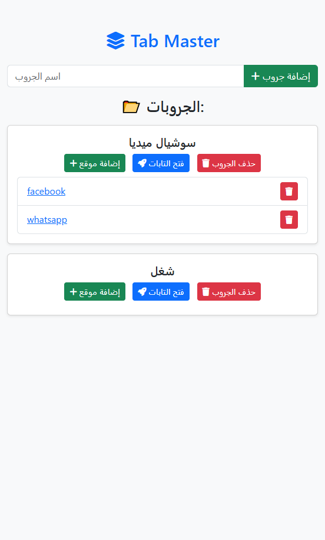

# 🚀 TabMaster - Smart Tab Manager

**TabMaster** is a simple and efficient web application that helps you manage and open groups of tabs with a single click! 🖥️🔥 Whether you're a student, developer, or researcher, this tool will boost your productivity and keep your work organized.

## 🎯 Features

✅ Create groups to save your important website links.  
✅ Add and remove websites within each group.  
✅ Open all links in a group with one click.  
✅ Store data locally using `localStorage`.  
✅ Simple and user-friendly interface.

## 📸 Screenshots



## 🚀 How to Use

1. **Add a New Group**: Enter a group name and click "Add Group".
2. **Add Websites to a Group**: Click the ➕ button next to the group name.
3. **Open All Websites in a Group**: Click the 🚀 button to open all saved links.
4. **Delete a Group or Website**: Use the 🗑️ button to remove any item.

## 🛠️ Technologies Used

- **HTML** - For structuring the page.
- **CSS (Bootstrap)** - For a clean and responsive design.
- **JavaScript (Vanilla JS)** - To handle functionalities and data.
- **SweetAlert2** - For beautiful alert modals.

## 📦 Installation & Running

1. **Clone the Repository**

```bash
git clone https://github.com/HaSh3003/TabMaster
cd TabMaster
```

## 📜 License

This project is **open-source**. Feel free to modify and use it!

---

## 🤝 Contributing

Want to improve it? **Fork the repo, make changes, and submit a pull request!** 🚀

---

## 📧 Contact

If you have any questions, feel free to reach out!

📩 Email: [perfecto.dev@programmer.net](mailto:perfecto.dev@programmer.net)\
🐦 Twitter: [@HaSh_Perfecto](https://x.com/HaSh_Perfecto)\
💻 GitHub: [HaSh3003](https://github.com/HaSh3003)
